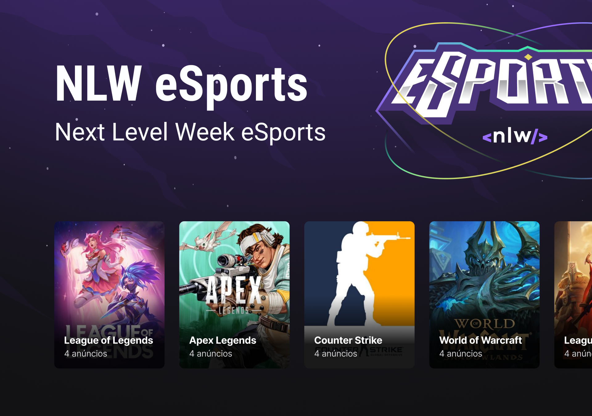

<h1 align="center">NLW eSports</h1>

<div align="center" id="top">
  

&#xa0;

  <!-- <a href="https://{{app_url}}.netlify.app">Deploy</a> -->
</div>

<p align="center">
  

  

  

  

  

  

  
</p>

Status

<h4 align="center">
 🚧  NLW eSports 🚀 Under construction...  🚧
</h4>

<hr>

<p align="center">
  <a href="#dart-about">About</a> &#xa0; | &#xa0;
  <a href="#rocket-technologies">Technologies</a> &#xa0; | &#xa0;
  <a href="#white_check_mark-requirements">Requirements</a> &#xa0; | &#xa0;
  <a href="#checkered_flag-starting">Starting</a> &#xa0; | &#xa0;
  <a href="#memo-license">License</a> &#xa0; | &#xa0;
  <a href="https://github.com/jose-bone" target="_blank">Author</a>
</p>

<br>

## :dart: About

Unprecedented thematic project of the gaming universe.

## :rocket: Technologies

The following technologies were used in this project:

- [HTML](https://developer.mozilla.org/en-US/docs/Learn/HTML)
- [CSS](https://developer.mozilla.org/en-US/docs/Learn/CSS)
<!-- - [JavaScript](https://developer.mozilla.org/en-US/docs/Learn/JavaScript) -->

## :white_check_mark: Requirements

Before starting :checkered_flag:, you need to have [Git](https://git-scm.com) and [VSCode](https://code.visualstudio.com) installed.

## :checkered_flag: Starting

```bash
# Clone this project
$ git clone https://github.com/jose-bone/nlw-eSports.git

# Access
$ cd nlw-eSports/
```

## :memo: License

This project is under license from MIT. For more details, see the [LICENSE](LICENSE.md) file.

Made with 💜 by <a href="https://github.com/jose-bone" target="_blank">José Boné</a>

&#xa0;

<a href="#top">Back to top</a>
